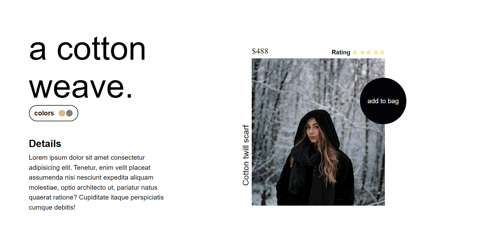

# CSS Project 2

## Description

This project involves developing a responsive and user-friendly interface using HTML and CSS. The goal is to create a dynamic web experience with consistent cross-browser compatibility. Key features include a clean design, intuitive navigation, and adaptive layouts that enhance user interaction across various devices.

## Features

- *Responsive Design*: Adapts seamlessly to various screen sizes and devices.
- *Cross-Browser Compatibility*: Ensures consistent performance across different web browsers.
- *Clean and Intuitive UI*: Focuses on user experience with a simple and elegant interface.
- *Dynamic Content Rendering*: Utilizes CSS for dynamic and engaging content presentation.

## Workflow

The development process follows a structured workflow:
1. *Planning*: Outline the project scope, goals, and design.
2. *Implementation*: Develop the HTML and CSS code.
3. *Testing*: Ensure functionality and compatibility across devices and browsers.
4. *Deployment*: Launch the project and make it accessible to users.

## Contribution Guidelines

We welcome contributions! Please follow these guidelines:
1. *Fork the Repository*: Create a personal copy of the project.
2. *Create a Branch*: Use a descriptive name for your branch (e.g., feature/new-layout).
3. *Commit Changes*: Write clear, concise commit messages.
4. *Open a Pull Request*: Describe your changes and submit your pull request.

## Getting Started

To get a local copy up and running, follow these steps:

1. *Clone the Repository*:
    bash
    git clone https://github.com/abhinavraghav1105/CSS-Project-2.git
    

2. *Open the Project*:
    bash
    cd CSS-Project-2
    

3. *Open in Visual Studio Code*:
    bash
    code .
    

## License

This project is licensed under the MIT License.

## Contact

For questions or feedback, please reach out to the repository owner.

---

Thank you for visiting and contributing to this project!
